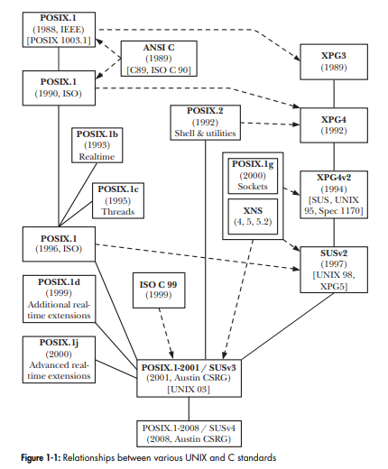

# [Embedded Linux](https://github.com/FMFigueroa/Embedded-Linux-Kernel)

## Chapter 1 - Introducción a Linux Kernel

### Historia de Linux

Este capítulo presenta el kernel de Linux y el sistema operativo Linux, antes de entender Linux, primero debemos conocer sus origenes, primero hablemos del sistema operativo llamado Unix.
Unix fue creado por primera vez hace más de 40 años.

Linux es un miembro de la familia de sistemas operativos UNIX. En términos de computación, UNIX tiene una larga historia. La primera parte de este capítulo proporciona un breve resumen de esa historia comenzamos con una descripción de los orígenes del sistema UNIX y el lenguaje de programación C, y luego considere las dos corrientes clave que llevaron a el Sistema Linux tal como existe hoy: el proyecto GNU y el desarrollo de Linux núcleo.

Una de las características notables del sistema UNIX es que su desarrollo no fue controlado por un solo proveedor u organización. Más bien, muchos grupos, tanto comerciales como no comerciales, contribuyeron a su evolución. Esta historia dio lugar a muchos características innovadoras que se agregaron a UNIX, pero también tuvo la consecuencia negativa que las implementaciones de UNIX divergieron con el tiempo, por lo que escribir aplicaciones que trabajen en todas las implementaciones de UNIX se hizo cada vez más difícil. Esto condujo a una impulso para la estandarización de las implementaciones de UNIX.

### Una breve historia de UNIX y C

La primera implementación de UNIX se desarrolló en 1969 (el mismo año que Linus Torvalds nació ) por Ken Thompson en Bell Laboratories, una división de la corporación telefónica AT&T. Fue escrito en ensamblador para una mini computadora Digital PDP-7. El nombre UNIX es un juego de palabras con MULTICS (Multiplexed Information and servicio informático), el nombre de un proyecto de sistema operativo anterior en el que AT&T colaboró ​​con el Instituto Tecnológico de Massachusetts (MIT) y General Electric. (AT&T ya se había retirado del proyecto frustrado por su inicial fracaso en el desarrollo de un sistema económicamente útil.) Thompson extrajo varias ideas para su nuevo sistema operativo de MULTICS, que incluye un sistema de archivos con estructura de árbol, un programa separado para interpretar comandos (el shell) y la noción de archivos como flujos de bytes no estructurados.

En 1970, UNIX fue reescrito en lenguaje ensamblador para un Digital recién adquirido Minicomputadora PDP-11, luego una máquina nueva y poderosa. Vestigios de este PDP-11 El patrimonio se puede encontrar en varios nombres que todavía se usan en la mayoría de las implementaciones de UNIX, incluyendo Linux.

Poco tiempo después, Dennis Ritchie, uno de los colegas de Thompson en Bell Laboratories y uno de los primeros colaboradores de UNIX, diseñó e implementó el lenguaje de programación C. Este fue un proceso evolutivo; C siguió a uno anterior lenguaje interpretado, B. B fue implementado inicialmente por Thompson y atrajo a muchos de sus ideas de un lenguaje de programación aún anterior llamado BCPL. Para 1973, C había maduró hasta un punto en el que el kernel de UNIX podría reescribirse casi por completo en el nuevo idioma UNIX se convirtió así en uno de los primeros sistemas operativos en ser escrito en un lenguaje de alto nivel, hecho que hizo posible su posterior portabilidad a otras arquitecturas de hardware.

La génesis de C explica por qué él y su descendiente C++ han llegado a usarse tan ampliamente como los lenguajes de programación de sistemas en la actualidad. Idiomas anteriores ampliamente utilizados fueron diseñados con otros propósitos en mente: FORTRAN para tareas matemáticas realizado por ingenieros y científicos; COBOL para procesamiento de sistemas comerciales
flujos de datos orientados a registros. C llenó un nicho hasta ahora vacío y, a diferencia de FOR TRAN y COBOL (que fueron diseñados por grandes comités), el diseño de C surgió de las ideas y necesidades de unas pocas personas que trabajan hacia un solo objetivo:
desarrollar un lenguaje de alto nivel para implementar el núcleo UNIX y asociados software. Al igual que el propio sistema operativo UNIX, C fue diseñado por profesionales programadores para su propio uso. El lenguaje resultante fue pequeño, eficiente, poderoso, conciso, modular, pragmático y coherente en su diseño.

Tras cuatro décadas de uso, los informáticos siguen considerando el sistema operativo Unix
como uno de los sistemas más potentes y elegantes que existen. Desde la creación de Unix en
1969, la creación de Dennis Ritchie y KenThompson se ha convertido en una criatura de puntas de pierna, un sistema cuyo diseño ha resistido la prueba del tiempo con pocas contusiones en su nombre.

Unix surgió de Multics, un proyecto fallido de sistema operativo multiusuario en el que Bell
Laboratories estuvo involucrado. Con el proyecto Multics terminado, los miembros del Centro de Investigación de Ciencias de la Computación de Bell Laboratories se encontraron sin un sistema operativo interactivo capaz. En el verano de 1969, los programadores de Bell Lab esbozaron un
diseño de sistema de archivos que finalmente evolucionó a Unix. Probando su diseño, Thompson implementó el nuevo sistema en un PDP-7 que de otro modo estaría inactivo. En 1971, Unix fue portado a la PDP-11, y en 1973, el sistema operativo fue reescrito en C, un paso sin precedentes en el momento, pero que allanó el camino para la futura portabilidad. El primer Unix ampliamente utilizado fuera de Bell Labs estaba Unix System, Sixth Edition, más comúnmente llamado V6.
Otras compañías portaron Unix a nuevas máquinas. Acompañando a estos puertos estaban
mejoras que resultaron en varias variantes del sistema operativo. En 1977, Laboratorios Bell
lanzó una combinación de estas variantes en un solo sistema, Unix System III.

### Primera a sexta ediciones de UNIX

Entre 1969 y 1979, UNIX pasó por varios lanzamientos, conocidos como ediciones.
Esencialmente, estos lanzamientos fueron instantáneas de la versión de desarrollo en evolución en
AT&T. [Salus, 1994] señala las siguientes fechas para las primeras seis ediciones de UNIX:

- Primera edición, noviembre de 1971: en ese momento, UNIX se ejecutaba en el PDP-11 y ya tenía un compilador FORTRAN y versiones de muchos programas que todavía se usan en la actualidad, incluidos ar, cat, chmod, chown, cp, cd, ed, find , ln, ls, mail, mkdir, mv, rm, sh, su y who.
- Segunda edición, junio de 1972: en ese momento, UNIX estaba instalado en diez máquinas dentro de AT&T.
- Tercera edición, febrero de 1973: esta edición incluía un compilador de C y la primera implementación de tuberías.
- Cuarta edición, noviembre de 1973: Esta fue la primera versión escrita casi en su totalidad en C.
- Quinta edición, junio de 1974: en ese momento, UNIX estaba instalado en más de 50 sistemas.
- Sexta edición, mayo de 1975: esta fue la primera edición que se usó ampliamente fuera de AT&T.

Durante el período de estos lanzamientos, el uso y la reputación de UNIX comenzaron a extenderse,
primero dentro de AT&T y luego más allá. Una importante contribución a este creciente conciencia fue la publicación de un artículo sobre UNIX en la revista ampliamente leída Comunicaciones de la ACM ([Ritchie & Thompson, 1974]).
En ese momento, AT&T tenía un monopolio autorizado por el gobierno en el sistema telefónico estadounidense. Los términos del acuerdo de AT&T con el gobierno de EE. UU. impedían de vender software, lo que significaba que no podía vender UNIX como producto.
En cambio, a partir de 1974 con la Quinta Edición, y especialmente con la Sexta Edición, AT&T licenció UNIX para uso en universidades por una tarifa de distribución nominal. los distribuciones universitarias incluían documentación y el código fuente del núcleo (alrededor de 10.000 líneas en ese momento).
El lanzamiento de UNIX de AT&T en las universidades contribuyó en gran medida a la popularidad
y el uso del sistema operativo, y en 1977, UNIX estaba funcionando en unos 500 sitios, incluyendo 125 universidades en los Estados Unidos y varios otros países. UNIX ofreció a las universidades un sistema operativo multiusuario interactivo que era barato pero potente, en una época en que los sistemas operativos comerciales eran muy caros. También dio a los departamentos universitarios de ciencias de la computación el código fuente de un sistema operativo real sistema, que podrían modificar y ofrecer a sus estudiantes para aprender y experimentar con. Algunos de estos estudiantes, armados con conocimientos de UNIX, se convirtieron Evangelistas de UNIX. Otros fundaron o se unieron a la multitud de empresas emergentes que venden estaciones de trabajo informáticas económicas que ejecutan el sistema operativo UNIX de fácil portabilidad.

### El nacimiento de BSD y System V

Enero de 1979 vio el lanzamiento de la séptima edición de UNIX, que mejoró la confiabilidad del sistema y proporcionó un sistema de archivos mejorado. Esta versión también contenía varias herramientas nuevas, incluidas awk, make, sed, tar, uucp, Bourne shell y un compilador FORTRAN 77. El lanzamiento de la séptima edición también es significativo porque, a partir de este punto, UNIX se bifurcó en dos variantes importantes: BSD y System V, cuyos orígenes ahora describimos brevemente.

Thompson pasó el año académico 1975/1976 como profesor invitado en la Universidad de California en Berkeley, la universidad de la que se había graduado. Allí, trabajó con varios estudiantes de posgrado, agregando muchas características nuevas a UNIX. (Uno de estos estudiantes, Bill Joy, posteriormente cofundó Sun Microsystems, una entrada temprana en el mercado de estaciones de trabajo UNIX.) Con el tiempo, muchos desarrollaron nuevas herramientas y funciones en Berkeley, incluido el shell C, el editor vi , un sistema de archivos mejorado (el Sistema de archivos rápidos de Berkeley), sendmail, un compilador Pascal y administración de memoria virtual en la nueva arquitectura Digital VAX.

Bajo el nombre de Berkeley Software Distribution (BSD), esta versión de UNIX, incluyendo su código fuente, llegó a ser ampliamente distribuido. La primera distribución completa fue 3BSD en diciembre de 1979. (Lanzamientos anteriores de Berkeley—BSD y 2BSD eran distribuciones de nuevas herramientas producidas en Berkeley, en lugar de UNIX completo distribuciones.)

En 1983, el Grupo de Investigación de Sistemas Informáticos de la Universidad de California en
Berkeley lanzó 4.2BSD. Esta versión fue importante porque contenía una implementación completa de TCP/IP, incluida la programación de aplicaciones de sockets (API) y una variedad de herramientas de red.
4.2BSD y su predecesor 4.1BSD se distribuyó ampliamente en universidades de todo el mundo. Ellos también formaron la base de SunOS (lanzado por primera vez en 1983), la variante de UNIX vendida por Sun.
Otros lanzamientos importantes de BSD fueron 4.3BSD, en 1986, y el lanzamiento final, 4.4BSD,
en 1993.

Mientras tanto, la legislación antimonopolio de EE. UU. forzó la disolución de AT&T ( maniobras legales comenzaron a mediados de la década de 1970, y la ruptura se hizo efectiva en 1982),
con la consecuencia de que, al dejar de tener el monopolio del teléfono se permitió a la empresa comercializar UNIX. Esto resultó en la liberación de System III (tres) en 1981. System III fue producido por UNIX Support de AT&T Group (USG), que empleó a muchos cientos de desarrolladores para mejorar UNIX y desarrollar aplicaciones UNIX (en particular, paquetes de preparación de documentos y herramientas de desarrollo de software). El primer lanzamiento de System V (cinco) siguió en 1983, y una serie de lanzamientos condujo al definitivo System V Release 4 (SVR4) en 1989, por momento en el que System V había incorporado muchas características de BSD, incluidas las instalaciones de trabajo en red. System V fue licenciado a una variedad de vendedores comerciales, quienes lo utilizaron como base de sus implementaciones UNIX.
Por lo tanto, además de las diversas distribuciones de BSD que se extendieron a través de la academia, a fines de la década de 1980, UNIX estaba disponible en una variedad de implementaciones comerciales en varios hardware. Estas implementaciones incluyeron SunOS de Sun y versiones posteriores Solaris, Ultrix y OSF/1 de Digital (actualmente, después de una serie de cambios de nombre y adquisiciones, HP Tru64 UNIX), AIX de IBM, HP-UX de Hewlett-Packard (HP), NeXTStep de NeXT, A/UX para Apple Macintosh y Microsoft y SCO XENIX para la arquitectura Intel x86-32. (A lo largo de este libro, la implementación de Linux para x86-32 se denomina Linux/x86-32).
contraste con los escenarios típicos de hardware propietario/sistema operativo del tiempo, donde cada proveedor producía una, o como mucho unas pocas, computadoras propietarias de arquitecturas de chips, en las que vendían sus propios sistemas operativos patentados.
La naturaleza propietaria de la mayoría de los sistemas de proveedores significaba que los compradores estaban bloqueados en un solo vendedor. Cambiar a otro sistema operativo y hardware propietarios la plataforma podría volverse muy cara debido a la necesidad de portar las aplicaciones existentes y volver a capacitar al personal. Este factor, junto con la aparición de estaciones de trabajo UNIX baratas para un solo usuario de una variedad de proveedores, hizo que el sistema UNIX portátil cada vez más atractivo desde una perspectiva comercial.

El elegante diseño original del sistema Unix, junto con los años de innovación y la mejora evolutiva que siguió, ha resultado en un potente, robusto y estable sistema operativo. Un puñado de características de Unix son el núcleo de su fortaleza.

Primero, Unix es simple: mientras que algunos sistemas operativos implementan miles de llamadas al sistema y tienen objetivos de diseño poco claros, los sistemas Unix implementan solo cientos de llamadas al sistema y tener un diseño sencillo, incluso básico.

En segundo lugar, en Unix, todo es un archivo.
Esto simplifica la manipulación de datos y dispositivos en un conjunto de llamadas al sistema central: open(), read(), write(), lseek() y close().

En tercer lugar, el kernel de Unix y las utilidades del sistema relacionadas son escrito en C, una propiedad que le da a Unix su increíble portabilidad a hardware diverso arquitecturas y accesibilidad a una amplia gama de desarrolladores. Cuarto, Unix tiene un proceso rápido
tiempo de creación y la única llamada al sistema fork(). Por último, Unix proporciona un sistema simple pero robusto primitivas de comunicación entre procesos (IPC) que, cuando se combinan con el proceso rápido tiempo de creación, permiten la creación de programas simples que hacen una cosa y la hacen bien.

Estos son los programas de un solo propósito se pueden unir para realizar tareas de complejidad creciente. Por lo tanto, los sistemas Unix exhiben capas limpias, con una fuerte separación entre la política y mecanismo.

En la actualidad, Unix es un sistema operativo moderno que admite tareas múltiples preventivas, subprocesos múltiples, memoria virtual, paginación bajo demanda, bibliotecas compartidas con carga bajo demanda y Redes TCP/IP. Muchas variantes de Unix escalan a cientos de procesadores, mientras que los otras sistemas Unix se ejecutan en dispositivos integrados pequeños. Aunque Unix ya no es una investigación proyecto, los sistemas Unix continúan beneficiándose de los avances en el diseño del sistema operativo mientras siendo un sistema operativo práctico y de propósito general.

Unix debe su éxito a la simplicidad y elegancia de su diseño. Su fuerza hoy se deriva de las decisiones inaugurales que Dennis Ritchie, Ken Thompson y que los otros primeros desarrolladores tomaron: elecciones que han dotado a Unix con la capacidad de evolucionar sin comprometerse.

### Una breve historia de Linux

El término Linux se usa comúnmente para referirse a todo el sistema operativo similar a UNIX del cual forma parte el kernel de Linux. Sin embargo, esto es algo así como un nombre inapropiado, ya que muchos de los componentes clave contenidos dentro de un comercial típico La distribución de Linux en realidad se originó a partir de un proyecto anterior al inicio de Linux por varios años.

Linus Torvalds desarrolló la primera versión de Linux en 1991 como sistema operativo para
ordenadores alimentados por el microprocesador Intel 80386, que en ese momento era un nuevo y
procesador avanzado. Linus, entonces estudiante de la Universidad de Helsinki, estaba perturbado por la falta de un sistema Unix poderoso pero libre. El sistema operativo de computadora personal reinante del día, el DOS de Microsoft, fue útil para Torvalds para poco más que jugar Prince of Persia.

Linus usó Minix, un Unix de bajo costo creado como ayuda para la enseñanza, pero se desanimó por
la incapacidad de realizar y distribuir fácilmente cambios en el código fuente del sistema (debido a licencia de Minix) y por decisiones de diseño tomadas por el autor de Minix.

En respuesta a su situación, Linus hizo lo que haría cualquier estudiante universitario normal:
Decidió escribir su propio sistema operativo. Linus comenzó escribiendo un terminal simple emulador, que usó para conectarse a sistemas Unix más grandes en su escuela. En el transcurso
del año académico, su emulador de terminal evolucionó y mejoró. En poco tiempo, Linus había
un Unix inmaduro pero completo en sus manos. Publicó un comunicado anticipado en Internet a fines de 1991.

El uso de Linux despegó, y las primeras distribuciones de Linux ganaron rápidamente muchos usuarios. Sin embargo, más importante para su éxito inicial es que Linux atrajo rápidamente a muchos desarrolladores: piratas informáticos que agregaban, cambiaban y mejoraban el código. Debido a los términos de su licencia, Linux evolucionó rápidamente hasta convertirse en un proyecto colaborativo desarrollado por muchos.

Un avance rápido hasta el presente. Hoy en día, Linux es un sistema operativo completo que también ejecuta en Alpha, ARM, PowerPC, SPARC, x86-64 y muchas otras arquitecturas. Funciona desde sistemas tan pequeños como un reloj hasta máquinas tan grandes como grupos de supercomputadoras que llenan una habitación.

Linux impulsa la electrónica de consumo más pequeña y los centros de datos más grandes. Hoy en día, el interés comercial en Linux es fuerte. Tanto las nuevas corporaciones específicas de Linux, como Red Hat y las potencias existentes, como IBM, están proporcionando soluciones basadas en Linux para necesidades integradas, móviles, de escritorio y de servidor.

Linux es un sistema similar a Unix, pero no es Unix. Es decir, aunque Linux toma prestadas muchas
ideas de Unix e implementa la API de Unix (según lo definido por POSIX y Single Especificación de Unix), no es un descendiente directo del código fuente de Unix como otros Unix sistemas. Donde se desea, se ha desviado del camino tomado por otras implementaciones, pero no ha abandonado los objetivos generales de diseño de Unix ni ha roto la interfaz de aplicación estandarizada.
Una de las características más interesantes de Linux es que no es un producto comercial; en cambio,
es un proyecto colaborativo desarrollado a través de Internet. Aunque Linus sigue siendo el creador de Linux y el mantenedor del núcleo, el progreso continúa a través de un tejido suelto.
grupo de desarrolladores. Cualquiera puede contribuir a Linux. El kernel de Linux, como ocurre con gran parte de el sistema, es un software gratuito o de código abierto.

Específicamente, el kernel de Linux tiene licencia bajo la Licencia Pública General GNU (GPL) versión 2.0. En consecuencia, puede descargar el código fuente y realizar las modificaciones que desee. La única advertencia es que si distribuir sus cambios, debe continuar brindando a los destinatarios los mismos derechos disfrutaste, incluida la disponibilidad del código fuente.

Linux es muchas cosas para muchas personas. Los elementos básicos de un sistema Linux son el kernel, C biblioteca, cadena de herramientas y utilidades básicas del sistema, como un proceso de inicio de sesión y shell. Un sistema Linux también puede incluir una implementación moderna del sistema X Window que incluye una función completa entorno de escritorio, como GNOME. Miles de aplicaciones gratuitas y comerciales existen para Linux. En este libro, cuando digo Linux normalmente me refiero al kernel de Linux. ambiguo, trato explícitamente de señalar si me estoy refiriendo a Linux como un sistema completo o solo el núcleo propiamente dicho. Estrictamente hablando, el término Linux se refiere solo al kernel.

### El Proyecto GNU

En 1984, Richard Stallman, un programador excepcionalmente talentoso que había sido
trabajando en el MIT, se dispuso a trabajar en la creación de una implementación UNIX "gratuita". de Stallman la perspectiva era moral, y libre se definía en un sentido legal, en lugar de un sentido financiero (ver http://www.gnu.org/philosophy/free-sw.html).
No obstante, lo legal es la libertad que Stallman describió conllevaba la consecuencia implícita de que software como los sistemas operativos estarían disponibles sin costo alguno oa muy bajo costo.

Stallman militó en contra de las restricciones legales impuestas a los sistemas operativos propietarios por parte de los vendedores de computadoras. Estas restricciones significaban que los compradores de software de computadora en general no podían ver el código fuente del software que estaban comprando.

comprando, y ciertamente no podrían copiarlo, cambiarlo o redistribuirlo. El Señaló que dicho marco alentaba a los programadores a competir entre sí y atesoran su trabajo, en lugar de cooperar y compartirlo.
En respuesta, Stallman inició el proyecto GNU (un acrónimo definido recursivamente para "GNU no es UNIX") para desarrollar un sistema similar a UNIX completo, disponible gratuitamente, consistente en un núcleo y todos los paquetes de software asociados, y alentó a otros a unirse a él. En 1985, Stallman fundó la Free Software Foundation (FSF), una organización sin fines de lucro para apoyar el proyecto GNU y el desarrollo de software libre en general.

Cuando se inició el proyecto GNU, BSD no era libre en el sentido que significaba Stallman. El uso de BSD todavía requería una licencia de AT&T y los usuarios podían no modificar y redistribuir libremente el código de AT&T que formaba parte de BSD.

Uno de los resultados importantes del proyecto GNU fue el desarrollo de la Licencia Pública General GNU (GPL), la encarnación legal de la noción de software libre de Stallman. Gran parte del software en una distribución de Linux, incluido el kernel, tiene licencia GPL o una de varias licencias similares. El software con licencia GPL debe estar disponible en forma de código fuente y debe poder redistribuirse libremente según los términos de la GPL. Las modificaciones al software con licencia GPL están permitidas libremente, pero cualquier distribución de dicho software modificado también debe estar bajo los términos de la GPL. Si el software modificado se distribuye en formato ejecutable, el autor también debe permitir a los destinatarios la opción de obtener la fuente modificada por no más del costo de distribución. La primera versión del
GPL se lanzó en 1989. La versión actual de la licencia, la versión 3, se lanzó en 2007. La versión 2 de la licencia, lanzada en 1991, sigue siendo de uso generalizado y es la licencia utilizada para el kernel de Linux. (Las discusiones sobre varias licencias de software libre se pueden encontrar en [St. Laurent, 2004] y [Rosen, 2005].)

El proyecto GNU inicialmente no produjo un núcleo UNIX en funcionamiento, pero produjo una amplia gama de otros programas. Dado que estos programas se diseñaron para ejecutarse en un sistema operativo similar a UNIX, podían usarse y se usaron en implementaciones UNIX existentes y, en algunos casos, incluso se trasladaron a otros sistemas operativos. Entre los programas más conocidos producidos por el proyecto GNU se encuentran el editor de texto Emacs, GCC (originalmente el compilador GNU C, pero ahora renombrado como colección de compiladores GNU, que comprende compiladores para C, C++ y otros lenguajes), bash shell y glibc (la biblioteca GNU C).

A principios de la década de 1990, el proyecto GNU había producido un sistema que estaba prácticamente completo, excepto por un componente importante: un núcleo UNIX en funcionamiento. El proyecto GNU había comenzado a trabajar en un diseño de kernel ambicioso, conocido como GNU/HURD, basado en el microkernel Mach. Sin embargo, la HURD estaba lejos de ser una forma que podría ser liberado. (Al momento de escribir este artículo, el trabajo continúa en HURD, que actualmente solo se ejecuta en la arquitectura x86-32).

Debido a que una parte significativa del código del programa que constituye lo que comúnmente se conoce como el sistema Linux en realidad se deriva del proyecto GNU, Stallman prefiere usar el término GNU/Linux para referirse a todo el sistema. La cuestión de la denominación (Linux versus GNU/Linux) es fuente de cierto debate en la comunidad del software libre. Dado que este libro se ocupa principalmente de la API del kernel de Linux, generalmente usaremos el término Linux.

El escenario estaba listo. Todo lo que se requería era un kernel en funcionamiento para ir con el otro sistema UNIX completo ya producido por el proyecto GNU.

### The Linux Kernel

En 1991, Linus Torvalds, un estudiante finlandés de la Universidad de Helsinki, se inspiró para escribir un sistema operativo para su PC Intel 80386. En el curso de sus estudios, Torvalds había entrado en contacto con Minix, un pequeño núcleo de sistema operativo similar a UNIX desarrollado a mediados de la década de 1980 por Andrew Tanenbaum, un profesor universitario en Holanda. Tanenbaum hizo que Minix, completo con el código fuente, estuviera disponible como una herramienta para enseñar el diseño de sistemas operativos en cursos universitarios. El kernel de Minix podría construirse y ejecutarse en un sistema 386. Sin embargo, dado que su propósito principal era como una herramienta de enseñanza, fue diseñado para ser en gran medida independiente de la arquitectura del hardware y no aprovechó al máximo las capacidades del procesador 386.

Torvalds, por lo tanto, comenzó un proyecto para crear un kernel UNIX eficiente y con todas las funciones para ejecutar en el 386. Durante unos meses, Torvalds desarrolló un kernel básico que le permitía compilar y ejecutar varios programas GNU. Luego, el 5 de octubre de 1991, Torvalds solicitó la ayuda de otros programadores, e hizo el siguiente anuncio, ahora muy citado, de la versión 0.02 de su kernel en el grupo de noticias comp.os.minix Usenet:

¿Suspiras por los buenos días de Minix-1.1, cuando los hombres eran hombres?
y escribió sus propios controladores de dispositivo? ¿No tienes un buen proyecto y te mueres por aprender un sistema operativo que puedes intentar modificar para tus necesidades? ¿Te resulta frustrante cuando todo funciona en Minix? ¿Se acabaron las noches enteras para que un programa ingenioso funcione? Entonces esta publicación podría ser solo para ti. Como mencioné hace un mes, estoy trabajando en una versión gratuita similar a Minix para computadoras AT-386. Finalmente ha llegado a la etapa en la que incluso se puede usar (aunque puede que no dependa de lo que quieras), y estoy dispuesto a publicar las fuentes para una distribución más amplia. Es solo la versión 0.02 pero he ejecutado con éxito bash, gcc, gnu-make, gnu-sed, compress, etc. debajo de él.

Siguiendo una larga tradición de dar a los clones de UNIX nombres que terminan con la letra X, el kernel (finalmente) fue bautizado como Linux. Inicialmente, Linux se colocó bajo una licencia más restrictiva, pero Torvalds pronto lo puso a disposición bajo la GNU GPL.
La llamada de apoyo resultó eficaz. Otros programadores se unieron a Torvalds en el desarrollo de Linux, agregando varias funciones, como un sistema de archivos mejorado, compatibilidad con redes, controladores de dispositivos y compatibilidad con multiprocesadores. En marzo de 1994, los desarrolladores pudieron lanzar la versión 1.0. Linux 1.2 apareció en marzo de 1995, Linux 2.0 en junio de 1996, Linux 2.2 en enero de 1999 y Linux 2.4 en enero de 2001. El trabajo en el kernel de desarrollo 2.5 comenzó en noviembre de 2001 y condujo al lanzamiento de Linux 2.6 en diciembre de 2003.

### Berkeley Software Distribution BSD

Vale la pena señalar que otro UNIX gratuito ya estaba disponible para x86-32 a principios de la década de 1990. Bill y Lynne Jolitz habían desarrollado un puerto del ya maduro sistema BSD para x86-32, conocido como 386/BSD. Este puerto se basó en la versión BSD Net/2 (junio de 1991), una versión del código fuente 4.3BSD en la que todo el código fuente propiedad de AT&T restante se reemplazó o, en el caso de seis archivos de código fuente que no se pudieron trivialmente reescrito, eliminado. Los Jolitzes portaron el código Net/2 a x86-32, reescribieron los archivos fuente que faltaban e hicieron el primer lanzamiento (versión 0.0) de 386/BSD en febrero de 1992.

Después de una ola inicial de éxito y popularidad, el trabajo en 386/BSD se retrasó por varias razones. Ante una acumulación cada vez mayor de parches, pronto aparecieron dos grupos de desarrollo alternativo que crearon sus propios lanzamientos basados ​​en 386/BSD: NetBSD, que hace hincapié en la portabilidad a una amplia gama de plataformas de hardware, y FreeBSD, que hace hincapié en el rendimiento y es el más extendido de los BSD modernos. El primer lanzamiento de NetBSD fue 0.8, en abril de 1993. El primer CD-ROM de FreeBSD (versión 1.0) apareció en diciembre de 1993. Otro BSD, OpenBSD, apareció en 1996 (como una versión inicial numerada 2.0) después de bifurcarse del proyecto NetBSD. OpenBSD enfatiza la seguridad. A mediados de 2003, apareció un nuevo BSD, DragonFly BSD, después de una división de FreeBSD 4.x. DragonFly BSD adopta un enfoque diferente al de FreeBSD 5.x con respecto al diseño de arquitecturas de procesamiento múltiple simétrico (SMP). Probablemente ninguna discusión sobre los BSD a principios de la década de 1990 está completa sin mencionar los juicios entre UNIX System Laboratories (USL, la subsidiaria de AT&T escindida para desarrollar y comercializar UNIX) y Berkeley. A principios de 1992, la empresa Berkeley Software Design, Incorporated (BSDi, actualmente parte de Wind River) comenzó a distribuir BSD UNIX, BSD/OS, con soporte comercial, basado en la versión Net/2 y las adiciones 386/BSD de Jolitzes. BSDi distribuyó binarios y código fuente por $995 (dólares estadounidenses) y aconsejó a los clientes potenciales que usaran su número de teléfono 1-800-ITS-UNIX.

En abril de 1992, USL presentó una demanda contra BSDi en un intento de evitar que BSDi vendiera un producto que, según USL, todavía estaba gravado por el código fuente y los secretos comerciales de propiedad de USL. USL también exigió que BSDi dejara de usar el número de teléfono engañoso. La demanda finalmente se amplió para incluir un reclamo contra la Universidad de California. El tribunal finalmente desestimó todos los reclamos de USL, excepto dos, y se produjo una contrademanda de la Universidad de California contra USL, en la que la universidad afirmó que USL no había otorgado el debido crédito por el uso del código BSD en System V.

Mientras estas demandas estaban pendientes, USL fue adquirida por Novell, cuyo director ejecutivo, el difunto Ray Noorda, declaró públicamente que preferiría competir en el mercado en lugar de en los tribunales. Finalmente se llegó a un acuerdo en enero de 1994, y se le pidió a la Universidad de California que eliminara 3 de los 18 000 archivos de la versión Net/2, realizara algunos cambios menores en algunos otros archivos y agregara avisos de derechos de autor de la USL a otros 70 archivos que, sin embargo, la universidad podría seguir distribuyendo libremente. Este sistema modificado se lanzó como 4.4BSD-Lite en junio de 1994. (La última versión de la universidad fue 4.4BSD-Lite, Versión 2 en junio de 1995). En este punto, los términos del acuerdo legal requerían BSDi, FreeBSD y NetBSD para reemplazar su base Net/2 con el código fuente 4.4BSD-Lite modificado. Como señala [McKusick et al., 1996], aunque esto provocó cierto retraso en el desarrollo de los derivados de BSD, también tuvo el efecto positivo de que estos sistemas se resincronizaron con los tres años de trabajo de desarrollo realizado por el Departamento de Investigación de Sistemas Informáticos de la universidad. Group desde el lanzamiento de Net/2.

### Números de versión del kernel de Linux

Como la mayoría de los proyectos de software libre, Linux sigue un modelo de lanzamiento temprano y frecuente, de modo que las nuevas revisiones del kernel aparecen con frecuencia (a veces incluso a diario). A medida que aumentaba la base de usuarios de Linux, el modelo de lanzamiento se adaptó para disminuir la interrupción de los usuarios existentes. Específicamente, tras el lanzamiento de Linux 1.0, los desarrolladores del kernel adoptó un esquema de numeración de versiones del kernel con cada versión numerada x.y.z: x representa una versión principal, y una versión secundaria dentro de esa versión principal y z una revisión de la versión secundaria (mejoras menores y correcciones de errores).

Bajo este modelo, siempre se estaban desarrollando dos versiones del kernel: una rama estable para usar en sistemas de producción, que tenía un número de versión menor, y una rama de desarrollo más volátil, que llevaba el siguiente número de versión menor impar más alto. La teoría, que no siempre se siguió estrictamente en la práctica, era que todas las funciones nuevas debían agregarse en la serie de núcleos de desarrollo actual, mientras que las nuevas revisiones en la serie de núcleos estables debían limitarse a mejoras menores y correcciones de errores.
Cuando la rama de desarrollo actual se consideró adecuada para su lanzamiento, se convirtió en la nueva rama estable y se le asignó un número de versión aún menor. Por ejemplo, la rama del kernel de desarrollo 2.3.z resultó en la 2.4 rama estable del núcleo.

Después del lanzamiento del kernel 2.6, se cambió el modelo de desarrollo. La principal motivación para este cambio surgió de los problemas y frustraciones causados ​​por los largos intervalos entre las versiones estables del núcleo. (Pasaron casi tres años entre el lanzamiento de Linux 2.4.0 y 2.6.0). Periódicamente ha habido discusiones sobre cómo ajustar este modelo, pero los detalles esenciales siguen siendo los siguientes:

- Ya no existe una separación entre núcleos estables y de desarrollo. Cada nueva versión 2.6.z puede contener nuevas funciones y pasa por un ciclo de vida que comienza con la adición de nuevas funciones, que luego se estabilizan a lo largo del curso de una serie de versiones de lanzamiento candidatas. Cuando una versión candidata es considerado suficientemente estable, se lanza como kernel 2.6.z. Los ciclos de lanzamiento suelen durar unos tres meses.

- A veces, una versión estable 2.6.z puede requerir parches menores para corregir errores o problemas de seguridad. Si estas correcciones tienen una prioridad lo suficientemente alta y los parches se consideran lo suficientemente simples como para ser "obviamente" correctos, entonces, en lugar de esperar para la próxima versión 2.6.z, se aplican para crear una versión con una serie de el formulario 2.6.z.r, donde r es un número secuencial para una revisión menor de este Núcleo 2.6.z.

- La responsabilidad institucional se transfiere a los proveedores de distribución para garantizar la estabilidad del núcleo provisto con una distribución.

Los capítulos posteriores a veces mencionarán la versión del kernel en la que se encuentra una API en particular. se produjo un cambio (es decir, una llamada al sistema nueva o modificada). Aunque, antes de la 2.6.z serie, la mayoría de los cambios en el kernel ocurrieron en las ramas de desarrollo impares, generalmente nos referiremos a la siguiente versión estable del kernel en la que el cambio apareció, ya que la mayoría de los desarrolladores de aplicaciones normalmente utilizarían un núcleo estable, en lugar de uno de los núcleos de desarrollo. En muchos casos, las páginas del manual tenga en cuenta el kernel de desarrollo preciso en el que apareció una característica particular o cambió.

Para los cambios que aparecen en la serie del kernel 2.6.z, notamos el kernel preciso versión. Cuando decimos que una función es nueva en el núcleo 2.6, sin un número de revisión z, nos referimos a una función que se implementó en la serie de núcleos de desarrollo 2.5 y apareció por primera vez en el kernel estable en la versión 2.6.0.

En el momento de redactar este informe, el kernel estable de Linux 2.4 aún cuenta con el soporte de los administradores que incorporan parches esenciales y correcciones de errores, y periódicamente liberar nuevas revisiones. Esto permite que los sistemas instalados continúen usando kernels 2.4, en lugar de verse obligados a actualizar a una nueva serie de kernels (que puede implicar un trabajo significativo en algunos casos).

### Puertos a otras arquitecturas de hardware

Durante el desarrollo inicial de Linux, la implementación eficiente en Intel 80386 fue el objetivo principal, en lugar de la portabilidad a otras arquitecturas de procesador. Sin embargo, con la creciente popularidad de Linux, comenzaron a aparecer puertos para otras arquitecturas de procesos, comenzando con un puerto temprano para el chip Digital Alpha.
La lista de arquitecturas de hardware a las que se ha portado Linux continúa creciendo e incluye x86-64, Motorola/IBM PowerPC y PowerPC64, Sun SPARC y SPARC64 (UltraSPARC), MIPS, ARM (Acorn), IBM zSeries (anteriormente System/390) , Intel IA-64 (Itanium; consulte [Mosberger & Eranian, 2002]), Hitachi SuperH, HP PA-RISC y Motorola 68000.

### Distribuciones de Linux

Precisamente hablando, el término Linux se refiere solo al núcleo desarrollado por Linus Torvalds y otros. Sin embargo, el término Linux se usa comúnmente para referirse al núcleo, además de una amplia gama de otro software (herramientas y bibliotecas) que juntos forman un sistema operativo completo. En los primeros días de Linux, se requería que el usuario ensamblara todo este software, creara un sistema de archivos y colocara y configurara correctamente todo el software en ese sistema de archivos. Esto demandó mucho tiempo y experiencia. Como resultado, se abrió un mercado para los distribuidores de Linux, quienes crearon paquetes (distribuciones) para automatizar la mayor parte del proceso de instalación, creando un sistema de archivos e instalando el kernel y otro software necesario.
Las primeras distribuciones aparecieron en 1992 e incluían MCC Interim Linux (Manchester Computing Centre, Reino Unido), TAMU (Texas A&M University) y SLS (SoftLanding Linux System). La distribución comercial más antigua que se conserva, Slackware, apareció en 1993. La distribución no comercial Debian apareció aproximadamente al mismo tiempo, y pronto le siguieron SUSE y Red Hat. El actualmente muy popular la distribución de Ubuntu apareció por primera vez en 2004. Hoy en día, muchas empresas de distribución también emplean programadores que contribuyen activamente a los proyectos de software libre existentes o inician nuevos proyectos.

### Standardization

A fines de la década de 1980, la amplia variedad de implementaciones de UNIX disponibles también tenía sus inconvenientes. Algunas implementaciones de UNIX se basaron en BSD, otras se basaron en System V y algunas extrajeron características de ambas variantes. Además, cada proveedor comercial había agregado funciones adicionales a su propia implementación. La consecuencia fue que trasladar software y personas de una implementación de UNIX a otra se hizo cada vez más difícil. Esta situación creó una fuerte presión para la estandarización del lenguaje de programación C y el sistema UNIX, de modo que las aplicaciones pudieran trasladarse más fácilmente de un sistema a otro. Veamos ahora los estándares resultantes.

### El lenguaje de programación C

A principios de la década de 1980, C había existido durante diez años y se implementó en una amplia variedad de sistemas UNIX y en otros sistemas operativos. Habían surgido diferencias menores entre las diversas implementaciones, en parte porque ciertos aspectos de cómo debería funcionar el lenguaje no estaban detallados en el estándar de facto existente para C, el libro de Kernighan y Ritchie de 1978, The C Programming Language. (La sintaxis de C más antigua descrita en ese libro a veces se llama C tradicional o K&R C). Además, la aparición de C++ en 1985 destacó ciertas mejoras y adiciones que se podían hacer a C sin romper los programas existentes, en particular los prototipos de unción, la asignación de estructuras, calificadores de tipo (const y volatile), tipos de enumeración y la palabra clave void.
Estos factores crearon un impulso para la estandarización C que culminó en 1989 con la aprobación del estándar C (X3.159-1989) del Instituto Nacional Estadounidense de Estándares (ANSI), que posteriormente fue adoptado en 1990 como una Organización Internacional de Estándares (ISO) estándar (ISO/IEC 9899:1990). Además de definir la sintaxis y la semántica de C, este estándar describía el funcionamiento de la biblioteca C estándar, que incluye las funciones stdio, funciones de manejo de cadenas, funciones matemáticas, varios archivos de encabezado, etc. Esta versión de C generalmente se conoce como C89 o (menos comúnmente) ISO C90, y se describe completamente en la segunda edición (1988) de The C Programming Language de Ker Nighan y Ritchie.
ISO adoptó una revisión del estándar C en 1999 (ISO/IEC 9899:1999; consulte http://www.open-std.org/jtc1/sc22/wg14/www/standards). Este estándar suele ser denominado C99, e incluye una serie de cambios en el idioma y su biblioteca estándar. Estos cambios incluyen la adición de tipos de datos long long y booleanos, comentarios estilo C++ (//), punteros restringidos y matrices de longitud variable. (En el momento de escribir este artículo, se está trabajando en una nueva revisión del estándar C, llamado informalmente C1X. Se espera que el nuevo estándar sea ratificado en 2011).
Los estándares C son independientes de los detalles de cualquier sistema operativo; es decir, no están vinculados al sistema UNIX. Esto significa que los programas de C escritos usando sólo la biblioteca de C estándar deben ser portátiles a cualquier computadora y sistema operativo que proporcione una implementación de C.

Históricamente, C89 a menudo se llamaba ANSI C, y este término a veces todavía se usa con ese significado. Por ejemplo, gcc emplea ese significado; su calificador –ansi significa "compatible con todos los programas ISO C90". Sin embargo, evitamos este término porque ahora es algo ambiguo. Desde que el comité ANSI adoptó el C99 revisión, hablando con propiedad, ANSI C ahora es C99.

### Los primeros estándares POSIX

El término POSIX (una abreviatura de Portable Operating System Interface) se refiere a un
grupo de normas desarrolladas bajo los auspicios del Instituto de Electricidad y Electronic Engineers (IEEE), específicamente su Comité de Estándares de Aplicaciones Portátiles (PASC, http://www.pasc.org/). El objetivo de los estándares PASC es promover portabilidad de aplicaciones a nivel de código fuente.
El nombre POSIX fue sugerido por Richard Stallman. Aparece la X final porque los nombres de la mayoría de las variantes de UNIX terminan en X. El estándar señala que el nombre debe pronunciarse "pahz-icks", como "positivo".
El más interesante de los estándares POSIX para nuestros propósitos es el primer POSIX
estándar, denominado POSIX.1 (o, más completamente, POSIX 1003.1), y el subsiguiente estándar POSIX.2.

### POSIX.1 y POSIX.2

POSIX.1 se convirtió en un estándar IEEE en 1988 y, con revisiones menores, fue adoptado como estándar ISO en 1990 (ISO/IEC 9945-1:1990). (Los estándares POSIX originales no están disponibles en línea, pero se pueden comprar en IEEE en http://www.ieee.org/). POSIX.1 se basó inicialmente en un estándar no oficial anterior (1984) producido por una asociación de proveedores de UNIX llamada /usr/group.

POSIX.1 documenta una API para un conjunto de servicios que un sistema operativo compatible debe poner a disposición de un programa. Un sistema operativo que hace esto puede certificarse como compatible con POSIX.1.

POSIX.1 se basa en la llamada al sistema UNIX y la función de biblioteca C API, pero no requiere ninguna implementación en particular para asociarse con esta interfaz. Esto significa que la interfaz puede ser implementada por cualquier sistema operativo, no es específicamente un sistema operativo UNIX. De hecho, algunos proveedores han agregado API a sus sistemas operativos patentados que los hacen compatibles con POSIX.1, mientras que en al mismo tiempo, dejando el sistema operativo subyacente prácticamente sin cambios.

También fueron importantes varias extensiones del estándar POSIX.1 original IEEE POSIX 1003.1b (POSIX.1b, anteriormente llamado POSIX.4 o POSIX 1003.4), ratificado en 1993, contiene una variedad de extensiones en tiempo real del estándar POSIX base.
IEEE POSIX 1003.1c (POSIX.1c), ratificado en 1995, es la definición de POSIX hilos. En 1996, una versión revisada del estándar POSIX.1 (ISO/IEC 9945-1:1996) fue producido, dejando el texto central sin cambios, pero incorporando el tiempo real y extensiones de hilos. IEEE POSIX 1003.1g (POSIX.1g) definió las API de red, incluyendo enchufes. IEEE POSIX 1003.1d (POSIX.1d), ratificado en 1999, y POSIX.1j, ratificado en 2000, definió extensiones adicionales en tiempo real al estándar base POSIX.

Las extensiones en tiempo real POSIX.1b incluyen sincronización de archivos; E/S asíncrona; programación de procesos; relojes y temporizadores de alta precisión; y comunicación entre procesos utilizando semáforos, memoria compartida y colas de mensajes. El prefijo POSIX a menudo se aplica a los tres métodos de comunicación entre procesos para distinguirlos de los semáforos, la memoria compartida y las colas de mensajes de System V similares, pero más antiguos.

Un estándar relacionado, POSIX.2 (1992, ISO/IEC 9945-2:1993), estandarizó el shell y varias utilidades de UNIX, incluida la interfaz de línea de comandos del compilador C.

### FIPS 151-1 y FIPS 151-2

FIPS es una abreviatura de Federal Information Processing Standard, el nombre de un conjunto de estándares especificados por el gobierno de los EE. UU. para la compra de su computadora sistemas En 1989, se publicó FIPS 151-1. Esta norma se basó en la de 1988 estándar IEEE POSIX.1 y el borrador del estándar ANSI C. La principal diferencia entre FIPS 151-1 y POSIX.1 (1988) fue que el estándar FIPS requería algunos características que POSIX.1 dejó como opcionales. Debido a que el gobierno de EE. UU. es un importante comprador de sistemas informáticos, la mayoría de los proveedores de computadoras se aseguraron de que sus sistemas UNIX se ajustaran a la versión FIPS 151-1 de POSIX.1. FIPS 151-2 se alineó con la edición ISO de 1990 de POSIX.1, pero por lo demás no se modificó. El ahora obsoleto FIPS 151-2 fue retirado como estándar en febrero de 2000.

### X/Open Company y el grupo abierto

X/Open Company fue un consorcio formado por un grupo internacional de proveedores de computadoras para adoptar y adaptar los estándares existentes con el fin de producir un conjunto completo y consistente de estándares de sistemas abiertos. Produjo el X/Open Portability Guide, una serie de guías de portabilidad basadas en los estándares POSIX. El primer lanzamiento importante de esta guía fue el número 3 (XPG3) en 1989, seguido por XPG4 en 1992. XPG4 fue revisado en 1994, lo que resultó en XPG4 versión 2, un estándar que también incorporó partes importantes de la definición de interfaz System V de AT&T Problema 3, descrito en la Sección 1.3.7. Esta revisión también se conoció como Spec 1170, con 1170 que se refiere al número de interfaces (funciones, archivos de encabezado y comandos) definida por la norma.

Cuando Novell, que adquirió el negocio de sistemas UNIX de AT&T a principios 1993, luego se desprendió de ese negocio, transfirió los derechos al UNIX marca registrada de X/Open. (El plan para hacer esta transferencia se anunció en 1993, pero los requisitos legales retrasaron la transferencia hasta principios de 1994). y también se conoce como UNIX 95. Este reempaquetado incluía XPG4 versión 2, el Especificación de la versión 2 de X/Open Curses Issue 4 y la especificación de X/Open Networking Services (XNS) Issue 4. Versión 2 de la especificación UNIX única (SUSv2, http://www.unix.org/version2/online.html) apareció en 1997 y UNIX las implementaciones certificadas con esta especificación pueden llamarse UNIX 98. (Este estándar también se conoce ocasionalmente como XPG5). En 1996, X/Open se fusionó con Open Software Foundation (OSF) para formar The Grupo abierto. Casi todas las empresas u organizaciones involucradas con el sistema UNIX ahora es miembro de The Open Group, que continúa desarrollando estándares API. OSF fue uno de los dos consorcios de proveedores formados durante las guerras UNIX de finales 1980 Entre otros, OSF incluyó a Digital, IBM, HP, Apollo, Bull, Nixdorf, y Siemens. OSF se formó principalmente en respuesta a la amenaza creada por un alianza comercial entre AT&T (los creadores de UNIX) y Sun (la empresa más poderoso jugador en el mercado de estaciones de trabajo UNIX). En consecuencia, AT&T, Sun, y otras empresas formaron el consorcio internacional UNIX rival.

### SUSv3 y POSIX.1-2001

A partir de 1999, el IEEE, The Open Group y el Comité Técnico Conjunto ISO/IEC El Comité 1 colaboró en el Grupo de Revisión de Estándares Comunes de Austin (CSRG, http://www.opengroup.org/austin/) con el objetivo de revisar y consolidar la estándares POSIX y la especificación UNIX única. (El Grupo Austin es tan nombrado porque su reunión inaugural fue en Austin, Texas en septiembre de 1998.) Esto resultó en la ratificación de POSIX 1003.1-2001, a veces simplemente llamado POSIX.1-2001, en diciembre de 2001 (posteriormente aprobada como norma ISO, ISO/CEI 9945:2002). POSIX 1003.1-2001 reemplaza SUSv2, POSIX.1, POSIX.2 y una serie de otros estándares POSIX anteriores. Este estándar también se conoce como la especificación única de UNIX.
Versión 3, y generalmente nos referiremos a ella en el resto de este libro como SUSv3.

Las especificaciones básicas de SUSv3 consisten en alrededor de 3700 páginas, divididas en
siguientes cuatro partes:

- Definiciones básicas (XBD): esta parte contiene definiciones, términos, conceptos y
  especificaciones del contenido de los archivos de cabecera. Se proporciona un total de 84 especificaciones de archivos de encabezado.
- Interfaces del sistema (XSH): esta parte comienza con diversa información básica útil. Su mayor parte consiste en la especificación de varias funciones (que son implementado como llamadas al sistema o funciones de biblioteca en implementaciones específicas de UNIX). En esta parte se incluyen un total de 1123 interfaces del sistema.
- Shell and Utilities (XCU): Esto especifica la operación del shell y varios
  Comandos UNIX. En esta parte se especifica un total de 160 utilidades.
- Justificación (XRAT): esta parte incluye texto informativo y justificaciones relacionadas con las partes anteriores.

Además, SUSv3 incluye la especificación X/Open CURSES Issue 4 Version 2 (XCURSES), que especifica 372 funciones y 3 archivos de encabezado para la API de manejo de pantalla curses. En total, se especifican 1742 interfaces en SUSv3. Por el contrario, POSIX.1-1990 (con FIPS 151-2) especificó 199 interfaces y POSIX.2-1992 especificó 130 utilidades.
SUSv3 está disponible en línea en http://www.unix.org/version3/online.html. UNIX las implementaciones certificadas contra SUSv3 pueden llamarse UNIX 03. Ha habido varias correcciones menores y mejoras para los problemas descubiertos desde la ratificación del texto SUSv3 original. Estos han dado como resultado la aparición del Corrección Técnica Número 1, cuyas mejoras fueron incorporadas en una revisión de 2003 de SUSv3, y la Corrección Técnica Número 2, cuyas Se incorporaron mejoras en una revisión de 2004.

### Conformidad con POSIX, conformidad con XSI y la extensión XSI

Históricamente, los estándares SUS (y XPG) diferían del POSIX correspondiente estándares y se estructuraron como superconjuntos funcionales de POSIX. Además de especificar interfaces adicionales, los estándares SUS hicieron obligatorios muchos de los interfaces y comportamientos que se consideraban opcionales en POSIX.

Esta distinción sobrevive algo más sutilmente en POSIX 1003.1-2001, que es un estándar IEEE y un estándar técnico de grupo abierto (es decir, como se indica ya es una consolidación de los estándares POSIX y SUS anteriores). Este documento define dos niveles de conformidad:

- Conformidad con POSIX: Esto define una línea de base de interfaces que un debe proporcionar la implementación. Permite la implementación para proporcionar otros interfaces opcionales.

- Conformidad con X/Open System Interface (XSI): para ser compatible con XSI, una implementación debe cumplir con todos los requisitos de conformidad con POSIX y también debe proporcionar una serie de interfaces y comportamientos que solo se requieren opcionalmente para conformidad con POSIX. Una implementación debe alcanzar este nivel de conformidad para obtener la marca UNIX 03 de The Open Group.

Las interfaces y los comportamientos adicionales necesarios para la conformidad con XSI se conocen colectivamente como la extensión XSI. Incluyen compatibilidad con funciones como subprocesos,
mmap() y munmap(), la API dlopen, límites de recursos, pseudoterminales, System V IPC, la API de syslog, encuesta () y contabilidad de inicio de sesión.

En capítulos posteriores, cuando hablamos de conformidad con SUSv3, nos referimos a XSI conformidad Debido a que POSIX y SUSv3 ahora son parte del mismo documento, el adicional
Las interfaces y la selección de opciones obligatorias requeridas para SUSv3 se indican mediante el uso de marcas de sombreado y margen dentro del texto del documento.

### Sin especificar y débilmente especificado

Ocasionalmente, nos referimos a una interfaz como "no especificada" o "débilmente especificada"
dentro de SUSv3.
Por una interfaz no especificada, nos referimos a una que no está definida en absoluto en el formato formal. estándar, aunque en algunos casos hay notas de antecedentes o texto de justificación que mencionar la interfaz.
Decir que una interfaz está débilmente especificada es una forma abreviada de decir que, mientras que la la interfaz está incluida en el estándar, los detalles importantes no se especifican (comúnmente porque los miembros del comité no pudieron llegar a un acuerdo debido a las diferencias en las implementaciones existentes).
Cuando usamos interfaces que no están especificadas o que están débilmente especificadas, tenemos pocas garantías al portar aplicaciones a otras implementaciones de UNIX. Sin embargo, en algunos casos, dicha interfaz es bastante consistente en todas las implementaciones,
y cuando esto es así, generalmente lo notamos como tal.

### Características de LEGADO

A veces, notamos que SUSv3 marca una característica específica como LEGADO. Este término denota una característica que se mantiene por compatibilidad con aplicaciones más antiguas, pero cuyas limitaciones significan que se debe evitar su uso en aplicaciones nuevas. En muchos casos, existe alguna otra API que proporciona una funcionalidad equivalente.

### SUSv4 y POSIX.1-2008

En 2008, el grupo de Austin completó una revisión de la especificación combinada POSIX.1 y Single UNIX. Al igual que con la versión anterior del estándar, consta de una especificación básica junto con una extensión XSI. Nos referiremos a esta revisión como SUSv4.

Los cambios en SUSv4 son menos amplios que los que ocurrieron para SUSv3. Los cambios más significativos son los siguientes:

- SUSv4 agrega nuevas especificaciones para una variedad de funciones. Entre las nuevas funciones especificadas que mencionamos en este libro se encuentran dirfd(), fdopendir(), fexecve(), futimens(), mkdtemp(), psignal(), strsignal() y utimensat(). Otra gama de nuevas funciones relacionadas con archivos (p. ej., openat(), descrita en la Sección 18.11) son análogas a funciones existentes (p. ej., open()), pero difieren en que interpretan funciones relativas.
  nombres de ruta con respecto al directorio al que hace referencia un descriptor de archivo abierto, en lugar de con respecto al directorio de trabajo actual del proceso.
- Algunas funciones especificadas como opciones en SUSv3 pasan a ser parte obligatoria del estándar base en SUSv4. Por ejemplo, varias funciones que formaban parte de la extensión XSI en SUSv3 pasan a formar parte del estándar base en SUSv4.
  Entre las funciones que se vuelven obligatorias en SUSv4 se encuentran las de la API dlopen (Sección 42.1), la API de señales en tiempo real (Sección 22.8), la API de semáforos POSIX (Capítulo 53) y la API de temporizadores POSIX (Sección 23.6).
- Algunas funciones en SUSv3 están marcadas como obsoletas en SUSv4. Estos incluyen asctime(), ctime(), ftw(), gettimeofday(), getitimer(), setitimer() y siginterrupt().
- Las especificaciones de algunas funciones que se marcaron como obsoletas en SUSv3 se eliminan en SUSv4. Estas funciones incluyen gethostbyname(), gethostbyaddr() y vfork().
- Varios detalles de las especificaciones existentes en SUSv3 se cambian en SUSv4. Por ejemplo, se agregan varias funciones a la lista de funciones que deben ser seguras para señales asíncronas (Tabla 21-1 en la página 426).
  En el resto de este libro, notamos cambios en SUSv4 donde son relevantes para el tema que se está discutiendo.

### Cronología de los estándares UNIX

La Figura 1-1 resume las relaciones entre los diversos estándares descritos en las secciones anteriores, y coloca las normas en orden cronológico. En esto diagrama, las líneas continuas indican descendencia directa entre estándares, y las discontinuas las flechas indican casos en los que un estándar influyó en otro estándar, se incorporó como parte de otro estándar o simplemente se aplazó a otro estándar.

La situación con los estándares de red es algo compleja. Los esfuerzos de estandarización en esta área comenzaron a fines de la década de 1980 con la formación de POSIX. 1003.12 para estandarizar la API de sockets, la API X/Open Transport Inter face (XTI) (una API de programación de red alternativa basada en System V Interfaz de la capa de transporte) y varias API asociadas. La gestación de este estándar ocurrió a lo largo de varios años, tiempo durante el cual se renombró POSIX 1003.12 POSIX 1003.1g. Fue ratificado en 2000.

Paralelamente al desarrollo de POSIX 1003.1g, X/Open también estaba desarrollando su especificación de red X/Open (XNS). La primera versión de esta especificación, XNS Issue 4, fue parte de la primera versión de Single UNIX Specification. Eso fue sucedido por XNS Issue 5, que formaba parte de SUSv2. El número 5 de XNS era esencialmente el mismo que el borrador actual (6.6) de POSIX.1g. Esto fue seguido por XNS Issue 5.2, que difería del XNS Issue 5 y el estándar POSIX.1g ratificado al marcar la API de XTI como obsoleta y al incluir la cobertura del Protocolo de Internet versión 6 (IPv6), que se diseñó a mediados de la década de 1990 ). Problema XNS 5.2
formó la base para el material de red incluido en SUSv3 y, por lo tanto, ahora reemplazado Por razones similares, POSIX.1g se retiró como estándar poco después fue ratificado.

### Estándares de implementación

Estándares de implementación
Además de los estándares producidos por grupos independientes o multipartidarios, a veces se hace referencia a los dos estándares de implementación definidos por el documento final.
Versión BSD (4.4BSD) y System V Release 4 (SVR4) de AT&T. El último estándar de implementación fue formalizado por la publicación de AT&T de la definición de interfaz System V (SVID). En 1989, AT&T publicó el número 3 de SVID, que definía la interfaz que debe proporcionar una implementación de UNIX para poder llamarse System V Release 4. (El SVID está disponible en línea en http://www.sco.com/desarrolladores/devspecs/.)

Debido a que el comportamiento de algunas llamadas al sistema y funciones de biblioteca varía entre
SVR4 y BSD, muchas implementaciones de UNIX proporcionan bibliotecas de compatibilidad y facilidades de compilación condicional que emulan el comportamiento de cualquier El sabor de UNIX no se usa como base para esa implementación en particular (ver Sección 3.6.1). Esto alivia la carga de portar una aplicación desde otra Implementación UNIX.

### Linux, estándares y la base estándar de Linux

Como objetivo general, el desarrollo de Linux (es decir, kernel, glibc y herramientas) tiene como objetivo cumplir a los diversos estándares UNIX, especialmente POSIX y Single UNIX Specification. Sin embargo, en el momento de escribir este artículo, ninguna distribución de Linux está marcada como “UNIX” por The Open Group. Los problemas son el tiempo y los gastos. Cada proveedor
la distribución tendría que someterse a pruebas de conformidad para obtener esta marca,
y necesitaría repetir esta prueba con cada nuevo lanzamiento de distribución. No obstante, es la casi conformidad de facto con varios estándares lo que ha permitido Linux para tener tanto éxito en el mercado UNIX.

Con la mayoría de las implementaciones comerciales de UNIX, la misma empresa desarrolla y distribuye el sistema operativo. Con Linux, las cosas son diferentes, en eso la implementación es independiente de la distribución, y múltiples organizaciones, ambas comercial y no comercial: manejar la distribución de Linux.

Linus Torvalds no contribuye ni respalda ninguna distribución de Linux en particular. Sin embargo, en términos de otras personas que llevan a cabo el desarrollo de Linux, el la situación es más compleja. Muchos desarrolladores que trabajan en el kernel de Linux y en otros proyectos de software libre son empleados por varias empresas de distribución de Linux o trabajar para empresas (como IBM y HP) con un fuerte interés en Linux. Tiempo estas empresas pueden influir en la dirección en la que se mueve Linux asignando horas de programador a determinados proyectos, ninguno de ellos controla Linux como tal. Y, por supuesto, muchos de los otros contribuyentes al kernel de Linux y proyectos GNU trabajar voluntariamente.

En el momento de escribir este artículo, Torvalds trabaja como miembro en la Fundación Linux (http://www.linux-foundation.org/; anteriormente Open Source Development Laboratory, OSDL), un consorcio sin fines de lucro de organizaciones comerciales y no comerciales creadas para fomentar el crecimiento de Linux.

Debido a que existen varios distribuidores de Linux y a que los implementadores del kernel no controlan el contenido de las distribuciones, no existe un comercial "estándar". Linux como tal. La oferta de kernel de cada distribuidor de Linux generalmente se basa en una instantánea del kernel de la línea principal (es decir, Torvalds) en un momento determinado, con un número de parches aplicados.

Estos parches suelen proporcionar características que, en mayor o menor medida, son considerada comercialmente deseable y, por lo tanto, capaz de proporcionar una diferenciación competitiva en el mercado. En algunos casos, estos parches se aceptan posteriormente en el núcleo principal. De hecho, algunas características nuevas del núcleo fueron desarrolladas inicialmente por una empresa de distribución y aparecieron en su distribución antes de ser finalmente distribuidas.

integrado en la línea principal. Por ejemplo, la versión 3 del archivo de diario de Reiserfs
sistema era parte de algunas distribuciones de Linux mucho antes de que fuera aceptado en el
Núcleo de la línea principal 2.4.

El resultado de los puntos anteriores es que hay diferencias (en su mayoría menores) en los sistemas ofrecidos por las distintas empresas distribuidoras de Linux. en mucho escala más pequeña, esto recuerda las divisiones en las implementaciones que ocurrieron en los primeros años de UNIX. Linux Standard Base (LSB) es un esfuerzo por garantizar la compatibilidad entre las diversas distribuciones de Linux. Para ello, el LSB (http://www.linux-foundation.org/en/LSB) desarrolla y promueve un conjunto de estándares para Sistemas Linux con el objetivo de garantizar que las aplicaciones binarias (es decir, los programas compilados) puedan ejecutarse en cualquier sistema compatible con LSB.

portabilidad promovida por POSIX. La portabilidad del código fuente significa que podemos escriba un programa en C y luego compílelo y ejecútelo con éxito en cualquier sistema compatible con POSIX. La compatibilidad binaria es mucho más exigente y, por lo general, no es factible en diferentes plataformas de hardware. Nos permite compilar un programa una vez para una plataforma de hardware dada, y luego ejecutarlo compilado programe en cualquier implementación conforme que se ejecute en esa plataforma de hardware. La portabilidad binaria es un requisito esencial para la viabilidad comercial de las aplicaciones de proveedores de software independientes (ISV) creadas para Linux.

### Resumen

El sistema UNIX se implementó por primera vez en 1969 en una minicomputadora Digital PDP-7 por Ken Thompson en Bell Laboratories (parte de AT&T). El sistema operativo dibujó muchas ideas, así como su nombre con juegos de palabras, del anterior sistema MULTICS. Por 1973, UNIX se trasladó a la minicomputadora PDP-11 y se reescribió en C, un lenguaje de programación diseñado e implementado en Bell Laboratories por Dennis Ritchie. Impedido legalmente de vender UNIX, AT&T distribuyó el sistema completo a las universidades por un cargo nominal. Esta distribución incluía fuente y se hizo muy popular dentro de las universidades, ya que proporcionaba un sistema operativo barato cuyo código podía ser estudiado y modificado por académicos y estudiantes de informática.

La Universidad de California en Berkeley desempeñó un papel clave en el desarrollo del sistema UNIX. Allí, Ken Thompson y varios estudiantes de posgrado amplió el sistema operativo. Para 1979, la Universidad estaba produciendo su propia Distribución UNIX, BSD. Esta distribución se generalizó en el mundo académico y formó la base para varias implementaciones comerciales.
Mientras tanto, la ruptura del monopolio de AT&T permitió a la empresa vender el sistema UNIX. Esto resultó en la otra variante principal de UNIX, System V, que también formó la base para varias implementaciones comerciales.

Dos corrientes diferentes llevaron al desarrollo de (GNU/) Linux. Uno de estos fue el proyecto GNU, fundado por Richard Stallman. A fines de la década de 1980, GNU El proyecto había producido una implementación de UNIX casi completa y de libre distribución. La única parte que faltaba era un kernel funcional. En 1991, inspirado por el núcleo Minix escrito por Andrew Tanenbaum, Linus Torvalds produjo un UNIX funcional.

kernel para la arquitectura Intel x86-32. Torvalds invitó a otros programadores a únase a él para mejorar el núcleo. Muchos programadores lo hicieron y, con el tiempo, Linux fue ampliado y portado a una amplia variedad de arquitecturas de hardware.
Los problemas de portabilidad que surgieron de las variaciones en las implementaciones de UNIX y C que existían a fines de la década de 1980 crearon una fuerte presión para la estandarización. El lenguaje C se estandarizó en 1989 (C89), y se revisó un estándar.

producido en 1999 (C99). El primer intento de estandarizar el sistema operativo interfaz produjo POSIX.1, ratificado como estándar IEEE en 1988 y como estándar ISO en 1990. Durante la década de 1990, se redactaron más estándares, incluidos varios versiones de la especificación UNIX única. En 2001, el POSIX combinado 1003.1-2001 y se ratificó el estándar SUSv3. Esta norma consolida y amplía diversas estándares POSIX anteriores y versiones anteriores de Single UNIX Specification. En
En 2008, se completó una revisión menos amplia del estándar, lo que produjo el estándar combinado POSIX 1003.1-2008 y SUSv4.

A diferencia de la mayoría de las implementaciones comerciales de UNIX, Linux separa la implementación de la distribución. En consecuencia, no existe una única distribución de Linux “oficial”. La oferta de cada distribuidor de Linux consiste en una instantánea del estable actual
kernel, con varios parches aplicados. LSB desarrolla y promueve un conjunto de estándares para sistemas Linux con el objetivo de garantizar la compatibilidad de aplicaciones binarias en todas las distribuciones de Linux, de modo que las aplicaciones compiladas deberían poder ejecutarse en
cualquier sistema compatible con LSB que se ejecute en el mismo hardware.

### Más información

Se puede encontrar más información sobre la historia y los estándares de UNIX en [Ritchie,
1984], [McKusick et al., 1996], [McKusick & Neville-Neil, 2005], [Libes & Ressler, 1989], [Garfinkel et al., 2003], [Stevens y Rago, 2005], [Stevens, 1999], [Quartermann y Wilhelm, 1993], [Goodheart y Cox, 1994] y [McKusick, 1999].

[Salus, 1994] es una historia detallada de UNIX, de la cual se extrajo gran parte de la información al comienzo de este capítulo. [Salus, 2008] ofrece una breve historia de Linux y otros proyectos de software libre. Muchos detalles de la historia de UNIX también se puede encontrar en el libro en línea Historia de UNIX, escrito por Ronda Hauben.

Este libro está disponible en http://www.dei.isep.ipp.pt/~acc/docs/unix.html. Una extremadamente
cronograma detallado que muestra los lanzamientos de varias implementaciones de UNIX puede ser
se encuentra en http://www.levenez.com/unix/.

[ Josey, 2004] proporciona una descripción general de la historia del sistema UNIX y la desarrollo de SUSv3, orientación sobre cómo usar la especificación, tablas de resumen de las interfaces en SUSv3, y guías de migración para las transiciones de SUSv2 a SUSv3 y C89 a C99.

Además de proporcionar software y documentación, el sitio web de GNU (http://www.gnu.org/) contiene una serie de artículos filosóficos sobre el tema de la libre software. [Williams, 2002] es una biografía de Richard Stallman.
Torvalds proporciona su propio relato del desarrollo de Linux en [Torvalds & Diamante, 2001].
